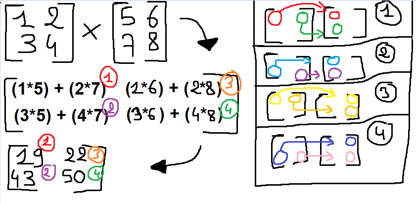
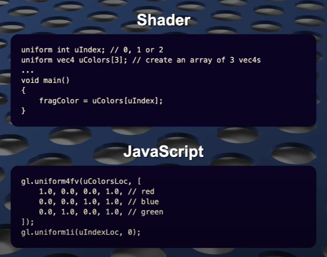
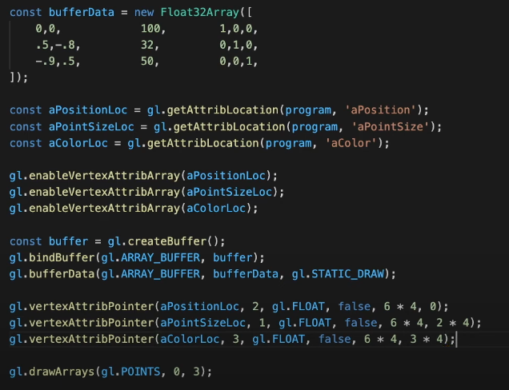

## DEV LOG #0 (before to 29/05/2025)

What I Learned :
1. CPU as hard time working on multi-tasking, why the existance of GPU.
2. Different Graphics APIs. (*OpenGL, DirectX or Vulkan..*)
3. OpenGL as WebGL, allow JS to communicate w/ Graphic API.
4. Vertices → Vertex Shader → Rasterizer → Fragment Shader → Final Output
5. Shaders are "GPU" code, while JS -*or others*- are "CPU" code.

Process:
1. Get the HTML tag "canvas" and request a WebGL2 context.
2. We create "Buffer". (*place in memory*)
    1. Bind it to an Array with static data.
3. We create "Vertex Shader", bind it the source code & compile it.
4. We create "Fragment Shader", bind it the source code & compile it.
5. We create "Program" and link the compiled shaders to it.
6. Retrieve the data from shader code "in". (*Vertex position & color*)
7. Retrieve the data from shader uniforms. (*location, size & canvas*)
8. Create Array, bind it and enable the Vertex position & color attributes.
    1. Specify the size, type of data and parameters of the attributes.
9. Clear the canvas
10. Set the viewport for the Rasterizer
11. Set the Program in use
12. Set the uniforms data, bind the 8. array and draw the vertices.

## DEV LOG #1 (30/05/2025)

[Now, we want and animation](https://youtu.be/lLa6XkVLj0w)

1. Move step 9 to 12 (*Canvas widht/height, Clearing the canvas..*) into it own function "frame".
    1.  Allow to call it multiple times. (*Thanks to a built-in js function <code>requestAnimationFrame</code>*)
2. Create a class "MovingShape" to generate our shape easily.
    1. The class takes a Position [x,y], Velocity [pixels,seconds], Size [number] and VAO [VertexArray].
    2. The class has a "update" function, with "dt" (*delta time*) argument.
    3. Delta represent the "mouvement" of the time and not just the time at a given time.
    4. "Update" update the position by adding: <code>position = ((position + velocity) * dt)</code>
3. Delta Time is calculated with two JS function <code>performance.now()</code>.
    1. <code>performance.now()</code> represent the time spent between last frame and now.
    2. We substract the <code>lastFrame</code> from the actual time spent on <code>thisFrame</code> to track delta time.
4. We replace the static draw calls, uniforms and updates to <code>.forEach()</code> loop.
    1. This allow us to create easily more triangles/objects.
    2. To do this, we create an array based on the class: <code>let shapes: MovingShape[] = [];</code>
5. Create a small <code>getRandom</code> to get random numbers between min / max.
6. Added constants at the beginning. (Spawn rate, shape limit, speed, size and time)
7. Added a <code>timeRemaining</code> and <code>isAlive()</code> in the constructor class <code>MovingShape</code>
8. Changed the <code>update</code> method to add the <code>timeRemaining</code> and removing <code>dt</code> from it.
9. Updating <code>timeToNextSpawn = timeToNextSpawn - dt</code>
10. While <code>timeToNextSpawn</code> is at 0, add SPAWN_RATE to itself.
    1. This means we need to spawn a shape!
    2. Get the angle from a random number between 0 and PI*2.
    3. Get the speed from a random number between min/max speed.
    4. The position is the middle of the canvas.
    5. The velocity is trigonometry from sin and cos of the angle times the speed.
    6. The size is a random from min / max sizes.
    7. TimeRemaining is retrieve from a random time between min and max life span.
    8. VAO is a random between 0 and 1 to choose the final color. (half rgb, half gradient)
    9. shape is the final construct, then it is pushed to the table.
11. We filter the shapes table by all active shapes and slice from 0 to SHAPE_COUNT_MAX.

## DEV LOG #2 (31/05/2025)

Added a <code>getShaderSource</code> function with Await/Promise to fetch the source code files and get the response to text (string).

What I Learned :
- I wanted to add annotations <code>/** @type {string} fruit_name */</code>, but apparently this is for JS Doc not TypeScript annotations. So I switched to this form of annotations <code>const fruit_name: string = "Apple"</code>.

What I did:
- I changed the annotations and read more about them and how they interact with JS/TS (thanks ThePrimeTime [for this video](https://www.youtube.com/watch?v=xJQ0qXh1-m0))
- Transfered the shaders code into separate files. Thx to ChatGPT, he helpt me with loading the shaders files (with a simple fetch... that I could found myself, but I though it would have been a better solution...)

Had to move out the documentation on shaders here:

<code>" #version 300 es " is mandatory (GLSL Embedded Systems 3.0).</code>  
<code>gl_Position = vec4(x, y, z-sorting [-1;1], w) [built-in]</code>  
<code>x, y and z are devided by w.</code>  
<code>canvasSize is divided by finalPosition = vertexPosition * size + location</code>  
<code>to make sure they are in range, we divide the finalPos by the canvasSize</code>  
<code>ClipPosition is a %, so we need to make it in range from -1 to 1 by adding (*2 - 1)</code>  
<code>We input a color to the fragment color to pass the color along the shaders.</code>  
<code>Fragment Shaders do not have built-in variables.</code>  
<code>We get the fragmentColor from the vertexShader.</code>

## DEV LOG #3 (05/06/2025)

> IMPORTANT : THE FOLLOWING ARE IN A "COLUMN-MAJOR" ORDER, BUT ROW-MAJOR MATRIX EXIST TOO, BE AWARE ! [SOURCE](https://stackoverflow.com/questions/75042112/multiplication-in-opengl-vertex-shader-using-column-major-matrix-does-not-draw-t?utm_source=chatgpt.com)

> IMPORTANT : IF IT'S "COLUMN-MAJOR" THE TRANSLATION IS IN THE INDICES 3, 7 AND 11. WHILE "ROW-MAJOR" IS IN 12, 13 AND 14.

> row_major = {1, 0, 0, x, 0, 1, 0, y, 0, 0, 1, z, 0, 0, 0, 1};
> column_major = {1, 0, 0, 0, 0, 1, 0, 0, 0, 0, 1, 0, x, y, z, 1};

What I Learned :

### Matrices: Translation Matrix

[See Tutorial Video by __pikuma__](https://www.youtube.com/watch?v=Do_vEjd6gF0)

| 1, 0, 0, 0,  
| 0, 1, 0, 0,  
| 0, 0, 1, 0,  
| 0, 0, 0, 1  
    * [x, y, z, 1]

This equal to:  
| x, 0, 0, tx,  
| 0, y, 0, ty,  
| 0, 0, z, tz,  
| 0, 0, 0, 1  

It is the same as doing:  
| (1 * x), (0 * y), (0 * z), (tx * 1),  
| (0 * x), (1 * y), (0 * z), (ty * 1),  
| (0 * x), (0 * y), (1 * z), (tz * 1),  
| (0 * x), (0 * y), (0 * z), (1 * 1)  

This equal to a vec4:  
| x + tx  
| y + ty  
| z + tz  
| 1

The "1" is also called "w".  
The "1" is needed to have a collum to change tx, ty and tz.  
Without it, we can change x, y or z.

### Multiply Matrices

[See Tutorial Video by __pikuma__](https://www.youtube.com/watch?v=UG530eh8q4A)

Matrix multiplication is only possible when the number of columns of the left matrix is equal to the number of rows on the right matrix.

We start with: [1 2 3 4] * [5 6 7 8]

That equal to:  
| (1 * 5) + (2 * 7) | (1 * 6) + (2 * 8)  
| (3 * 5) + (4 * 7) | (3 * 6) + (4 * 8)

And result to: [19 22 43 50]

To transform the calculation done to text: 
- top left * top left, top right * bottom left.
- top left * top right, top right * bottom right.
- bottom left * top left, bottom right * bottom left.
- bottom left * top right, bottom right * bottom right

Also can be:  
[a b c d] * [w x y z]  
| aw + by | ax + bz  
| cw + dy | cx + dz

See a pattern : 'abcd' 'abcd' on all sides and two times 'ww', 'yy', 'xx' and 'zz'.

## DEV LOG #4 (06/06/2025 → 9/06/2025)

What I Learned :

### Matrices: Perspective Projection Matrix

[See Tutorial Video by __pikuma__](https://www.youtube.com/watch?v=EqNcqBdrNyI)

1. We need to mutiply each vertex we see by this matrix to have the perspective projection view.
2. Perspective divide is when we divide x or y by z (depth)
    1. Closer = Bigger and Far Away = Smaller
3. The projection matrix is responsible for : 
    1. Aspect Ratio (adjust x/y based on screen width/height)
    2. Field of view (adjust x/y based on FOV angle)
    3. Normalization (adjust x/y/z to sit between -1 and 1)
4. Aspect Ratio = Height / Width (a = h / w)
5. tan(FOV/2) equals to half the field of view.
6. Normalization : z = depth | Lambda (λ) = (zfar / zfar - znear)
7. Convertion to screen space:
    1. [x, y, z] → [afx, fy, λz - λznear]
    2. [x] | af, 0, 0, 0,
    3. [y] | 0, f, 0, 0,
    4. [z] | 0, 0, λ, -λ * znear,
    5. [1] | 0, 0, 1, 0

## DEV LOG #5 (10/06/2025)

Old code that have been deleted, used to have 2 colors and one set of triangle base vertices.  
<code>[Top-x, Top-y, Left-x, Left-y, Right-x, Right-y]</code>  
<code>JS uses 64bit Arrays, and CPU prefer 32bits for half numbers.</code>  
<code>Default values, but changed by shaders.</code>  
<code>const triangleVertices = new Float32Array([0, 1, -1, -1, 1, -1]);</code>  
<code>const rgbTriangleColors = new Uint8Array([255, 0, 0, 0, 255, 0, 0, 0, 255]); // Colors</code>  
<code>const gradientTriangleColors = new Uint8Array([229, 47, 15, 246, 206, 29, 233, 154, 26]); // Colors</code>  

1. Added a "Geometry" file. [(source)](https://www.youtube.com/watch?v=_GSCxcmJ06A)
2. We have now: class.ts, function.ts, geometry.ts, main.ts and matrice.ts
3. Changed <code>createVAOBuffer</code> to go from triangle to square usage.
4. Changed <code>createStaticBuffer</code> to use <code>gl.ELEMENT_ARRAY_BUFFER or gl.ARRAY_BUFFER</code>
5. Added <code>createProgram</code> to easily create a vertex/fragment shader program.
6. Added a "Shape" class.

Old code that used to move shapes (triangles) at random angles and speed.  
<code>Update the time with deltatime: timeToNextSpawn -= dt;</code>  
We used to get a random angle and speed, a position based on the canvas and velocity based on angle/speed.  
Their lifespan were random, and colors based on a half-random.   
<code>const angle = fnc.getRandomInRange(0, 2 * Math.PI);</code>  
<code>const speed = fnc.getRandomInRange(SHAPE_SPEED.MIN, SHAPE_SPEED.MAX);</code>  
<code>const position: [number, number] = [canvas.width / 2, canvas.height / 2];</code>  
<code>const velocity: [number, number] = [Math.sin(angle) * speed, Math.cos(angle) * speed];</code>  
<code>const size = fnc.getRandomInRange(SHAPE_SIZE.MIN, SHAPE_SIZE.MAX);</code>  
<code>const timeRemaining = fnc.getRandomInRange(SHAPE_TIME.MIN, SHAPE_TIME.MAX);</code>  
<code>const vao = (Math.random() < 0.5) ? rgbTriangleVAO : gradientTriangleVAO;</code>  
<code>const shape = new cls.MovingShape(position, velocity, size, timeRemaining, vao);</code>  
<code>shapes.push(shape);</code>  
For each shape we used to filter them by their lifespan and update them.  
<code>shapes.forEach((shape) => {shape.update(dt);});</code>  
<code>shapes = shapes.filter((shape) => shape.isAlive()).slice(0, SHAPE_COUNT_MAX);</code>  
For each shape we used to set their uniform for size, location and position, to bind them, and finnaly draw them.  
<code>shapes.forEach((shape) => {});</code>  
<code>gl.uniform1f(sizeUniform, shape.size);</code>  
<code>gl.uniform2f(locationUniform, shape.position[0], shape.position[1]);</code>  
<code>gl.bindVertexArray(shape.vao);</code>  
<code>gl.drawArrays(gl.TRIANGLES, 0, 3);</code>  

I added new classes (Vec3, Quat and Mat4).   
This will be used to replace gl_matrix by my "own" (thx ChatGPT)  
Thanks to ChatGPT I could understand how this works on make it my own, even if the code is "simple" some part are more complex to me like understanding the normalization and quaternions.

I removed the old "Moving Shape" class.  
To construct it, you needeed a position, velocity, size, timeRemaining and a VAO.  
<code>Create a Class "MovingShape" with a position, velocity, size and vao arguments.</code>  
<code>The class as a method "update" with dt (delta time) argument.</code>  
<code>"Update" update the position by adding: position = ((position + velocity) * dt)</code>  
<code>Position is expressed in pixels and Velocity by pixels per seconds.</code>  

## DEV LOG #5 (11/06/2025 → 15/06/2025)

IT IS WORKING! IT IS ALIVE! [NEW TUTORIALS !](https://www.youtube.com/playlist?list=PLPbmjY2NVO_X1U1JzLxLDdRn4NmtxyQQo)  

What I learned:  
- WeblGL Program Struct:
    1. Create a Program.
    2. Create Vertex and Fragment Shaders.
    3. Set the source code for the shaders (.glsl or .vert .frag files)
    4. Compile the shaders.
    5. Attach them to the program.
    6. Link the program.
- Uniforms:
    - Available in vertex/fragment shader.
    - Cannot be changed during a draw call.
    - Are set w/ "uniform" in shaders and retrieve with "getUniformLocation(program, 'uniform_name')" in js.
    - Are global variables defined in shaders and set with js.
    - "gl.uniform4fv(loc, [1, 2, 3, 4])" to set a vec4 with an array
    - while "gl.uniform4f(loc, 1, 2, 3, 4)" set a vec4 with args.
    - can be usefull to set colors array. 
- Attributes:
    - Maximum 16 per program, some platforms allow more at risk. (gl.getParameter(gl.MAX_VERTEX_ATTRIBS))
    - Vertex attributes are: coordinates, color, transparency, texture mapping, and any float/matrices, etc.
    - Are only available in vextex shader (in) and need to be sent to fragment shader with out.
    - Can change for every vertex in the buffer.
    - Are bind with : gl.bindAttribLocation(program, value, 'attrib_name') in js before program is linked w/ shaders.
    - Also bind in shader with: layout(location = 0) in vec2 aAttributeName (static version)
    - Are float / made of floats in shaders while in js are chain of values with 8/16 bits integers.
    - gl.vertexAttribPointer() is used to tell opengl how to read thoses values from js.
    - attributes can be used to draw multiples objects on screen with the same bufferData bind in the buffer after enabling the vertex attribute array.
    
- Vertex:
    - 65,536 vertices is theorically possible, but at risk.